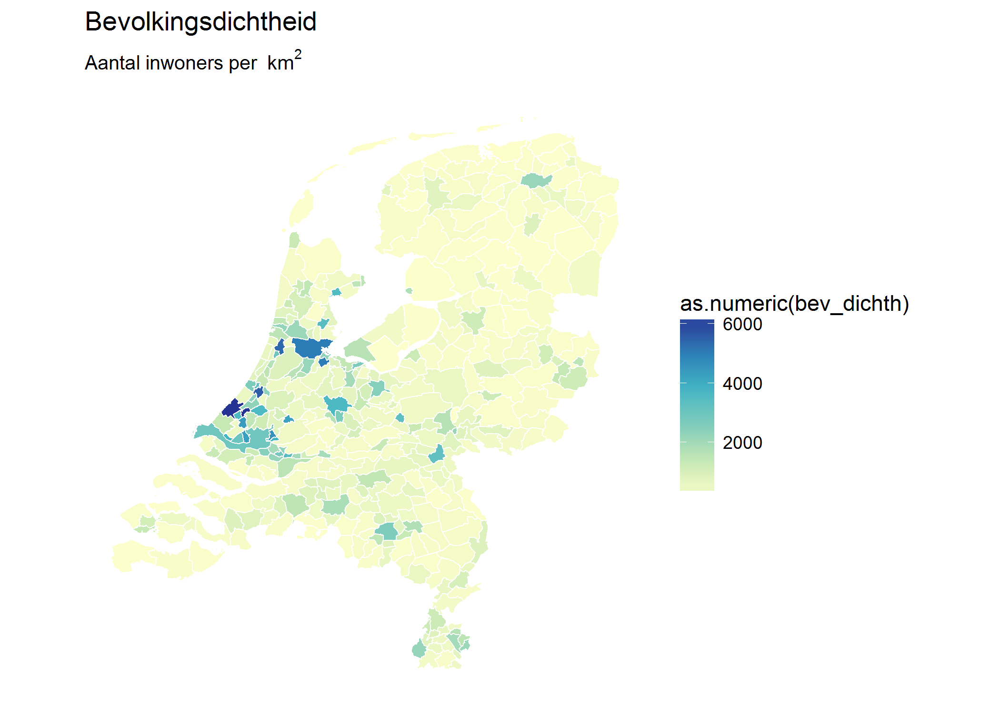

Basic choropleth
================
Hugo Janssen (nl-hugo)
23-10-2017

This document creates a basic choropleth from a CBS shapefile containing data about The Netherlands. Data provided by the Dutch Statistics Center [CBS](https://www.cbs.nl/en-gb) and [Kadaster](https://www.kadaster.com/). Similar to `choropleth_basic`, but this time with the help of the `mapNL` package.

### Setup

Load the required packages and specify the file locations.

``` r
#install.packages(c("ggplot2", "ggthemes", "devtools"))
library(ggplot2)
library(ggthemes)
library(devtools)

# loading the package may take a while
install_github("nl-hugo/mapNL")
```

### Plot

The data preparation steps can be skipped now that we use the `mapNL` package. Just create a plot of the map.

``` r
# create the plot
p <- ggplot(mapNL::gem_2017) + 
  aes(x = long, y = lat, group = group, fill = as.numeric(bev_dichth)) + 
  geom_polygon() +
  geom_path(colour = "white", size = 0.25) +
  scale_fill_distiller(palette = "YlGnBu", direction = 1) + 
  labs(x = NULL, 
       y = NULL, 
       title = "Bevolkingsdichtheid",
       subtitle = expression("Aantal inwoners per "~ km^2)) +
  coord_fixed(ratio = 1.5) +
  theme_minimal() +
  theme (
    panel.grid.major = element_blank(), 
    panel.grid.minor = element_blank(),
    axis.text = element_blank()
  )

p
```


